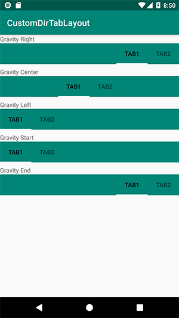

# CustomDirTabLayout

This is a TabLayout control with a new attribute named as `tabsGravity` that can be set by one of this values, `center`, `right`, `left`, `start` and `end`.

you should to set `app:tabMode="scrollable` and finally set `app:tabsGravity` as you need.

be noticed that `tabsGravity` is different with default TabLayout `tabGravity`

this project contains some important files in specified folder

* class file `CustomDirTabLayout` that shold be anywhere in your java folders
* attribute file `attr_custom_dir_tablayout` tha should be inside `res\values` folder in your project
 
#### XML Layout file sample

```xml
<ir.mahfa.customdirtablayout.CustomDirTabLayout
        android:layout_width="match_parent"
        android:layout_height="wrap_content"
        android:background="@color/colorPrimary"
        app:tabMode="scrollable"
        app:tabsGravity="right"><!-- can be right, left, center, start or end -->
```

 


### License
Licensed under MIT

farrokhpey@gmail.com
